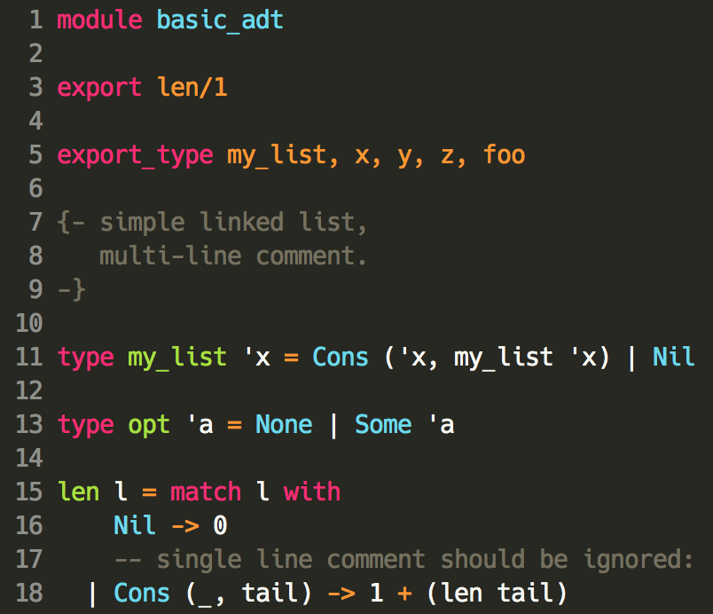

# alpaca-mode

*An [Emacs][] [major mode][] for the [Alpaca language][alpaca].*

## Examples

[][basic_adt]

## Authors

See [`AUTHORS`][AUTHORS].

## License

`alpaca-mode` is licensed under [the Apache License, Version 2.0][APL-2].

<!-- Named Links -->
[Emacs]: https://www.gnu.org/software/emacs/
[major mode]: https://www.gnu.org/software/emacs/manual/html_node/emacs/Major-Modes.html
[alpaca]: https://github.com/alpaca-lang/alpaca
[basic_adt]: https://github.com/alpaca-lang/alpaca/blob/master/test_files/basic_adt.alp
[AUTHORS]: ./AUTHORS
[APL-2]: https://www.apache.org/licenses/LICENSE-2.0
